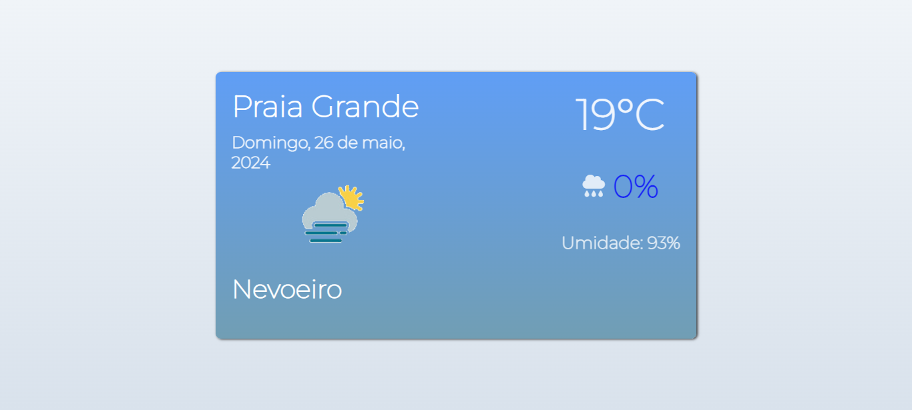

# Weather and Location Application

<div align="center">
    
</div>

## Introdução
Esta é uma aplicação web que exibe informações meteorológicas baseadas na localização geográfica do usuário. A aplicação utiliza a API da Weatherbit para obter dados climáticos e exibe informações como temperatura, probabilidade de chuva e umidade.

## Tecnologias Utilizadas
- **HTML5**: Estrutura da página web.
- **CSS3**: Estilos para a página.
- **JavaScript**: Lógica de funcionamento da aplicação.
- **jQuery**: Biblioteca JavaScript para simplificar manipulação de HTML e chamadas AJAX.
- **Moment.js**: Biblioteca para manipulação de datas e horas.
- **Weatherbit API**: Fonte dos dados meteorológicos.
- **FontAwesome**: Ícones para melhor visualização dos dados.

## Estrutura de Arquivos
```lua
|-- index.html
|-- style.css
|-- script.js
|-- img/
|   |-- loadGif.gif
